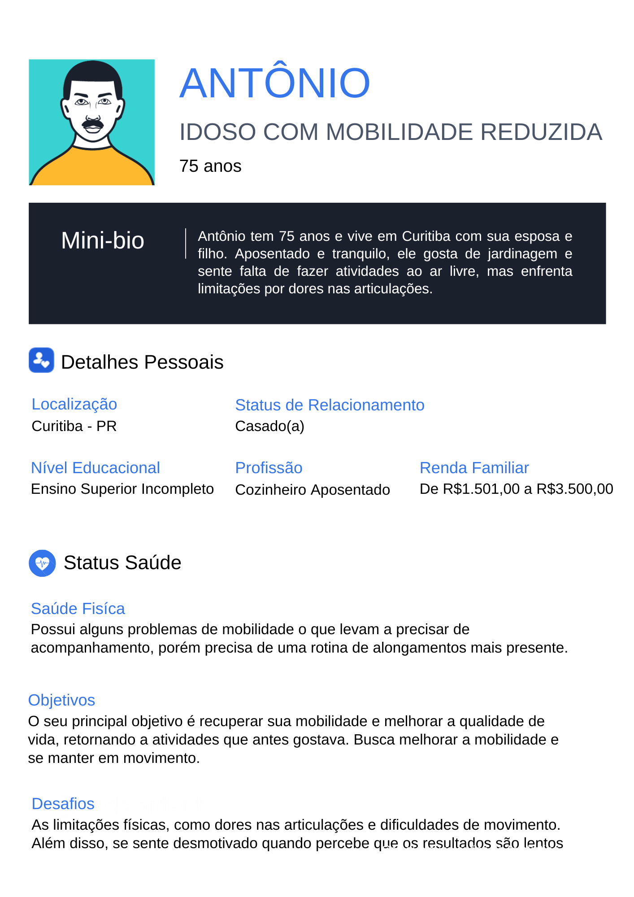
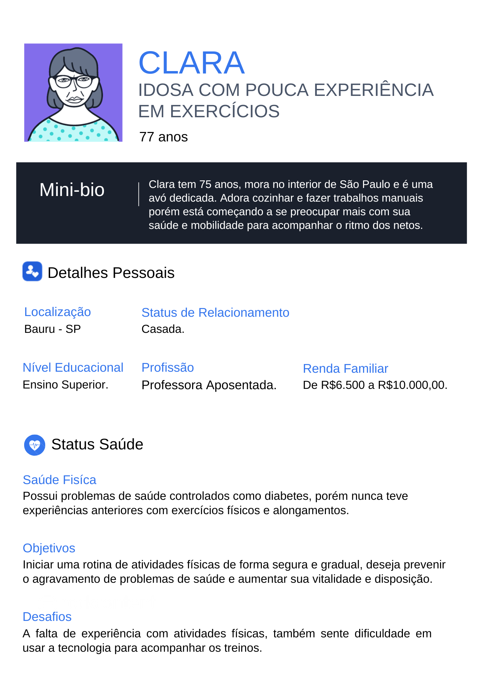

# 4. PROJETO DO DESIGN DE INTERAÇÃO

## 4.1 Personas

Desenvolvimento de seis personas que representam o público-alvo do projeto, sendo três usuários profissionais da saúde (médico, fisioterapeuta, personal trainer) e três idosos em diferentes níveis de atividade física.
Criado utilizando o programa: www.geradordepersonas.com.br

## 4.2 Mapa de Empatia

Mapa da Empatia é um material utilizado para conhecer melhor o seu cliente. A partir do mapa da empatia é possível detalhar a personalidade do cliente e compreendê-la melhor. O objetivo é obter um nível mais profundo de compreensão de uma persona. Com isso em mente, observe o mapa de empatia de todas as personas já citadas acima:

## 4.3 Protótipos das Interfaces
Apresente nesta seção os protótipos de alta fidelidade do sistema proposto. A fidelidade do protótipo refere-se ao nível de detalhes e funcionalidades incorporadas a ele. Assim, um protótipo de alta fidelidade é uma representação interativa do produto, baseada no computador ou em dispositivos móveis. Esse protótipo já apresenta maior semelhança com o design final em termos de detalhes e funcionalidades. No desenvolvimento dos protótipos, devem ser considerados os princípios gestálticos, as recomendações ergonômicas e as regras de design (como as 8 regras de ouro). É importante descrever no texto do relatório como os princípios gestálticos e as regras de ouro foram seguidas no projeto das interfaces. Nesta etapa deve-se dar uma ênfase na implementação do software de modo que possam ser realizados os testes com usuários na etapa seguinte.

