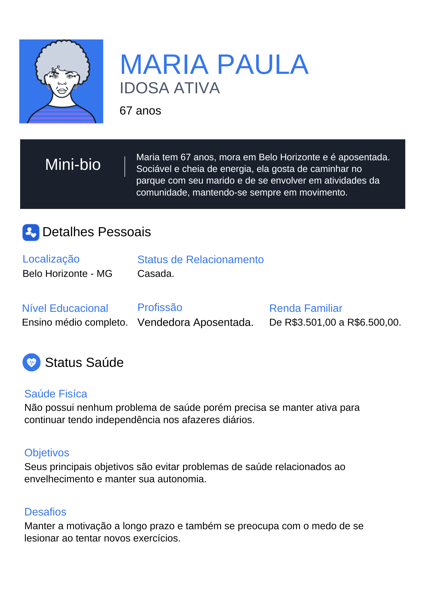

# 4. PROJETO DO DESIGN DE INTERAÇÃO

## 4.1 Personas

Desenvolvimento de seis personas que representam o público-alvo do projeto, sendo três usuários profissionais da saúde (médico, fisioterapeuta, personal trainer) e três idosos em diferentes níveis de atividade física.
Criado utilizando o programa: www.geradordepersonas.com.br

## 4.2 Mapa de Empatia

Mapa da Empatia é um material utilizado para conhecer melhor o seu cliente. A partir do mapa da empatia é possível detalhar a personalidade do cliente e compreendê-la melhor. O objetivo é obter um nível mais profundo de compreensão de uma persona. Com isso em mente, observe o mapa de empatia de todas as personas já citadas acima:

## 4.3 Protótipos das Interfaces

| Módulo |  Descrição     |Link  |
| :----: | :---: | :---: |
| Home | Página inicial | [Link](./telas/home.md) |
| Cadastro e login | Módulo dedicado a gerenciar o fluxo de autenticação do sistema | [Link](./telas/login.md) |
| Exercícios | Módulo dedicado a gerenciar o fluxo de exercícios do sistema | [Link](./telas/exercicios.md) |
| Consultas | Módulo dedicado a gerenciar o fluxo de consultas do sistema | [Link](./telas/consultas.md) |
| Blogs | Módulo dedicado a gerenciar o fluxo de blog do sistema | [Link](./telas/blog.md) |
| Eventos | Módulo dedicado a gerenciar o fluxo de eventos do sistema | [Link](./telas/events.md) |
| Configuração | Módulo dedicado a gerenciar as configurações do perfil de usuário | [Link](./telas/configuracao.md) |

