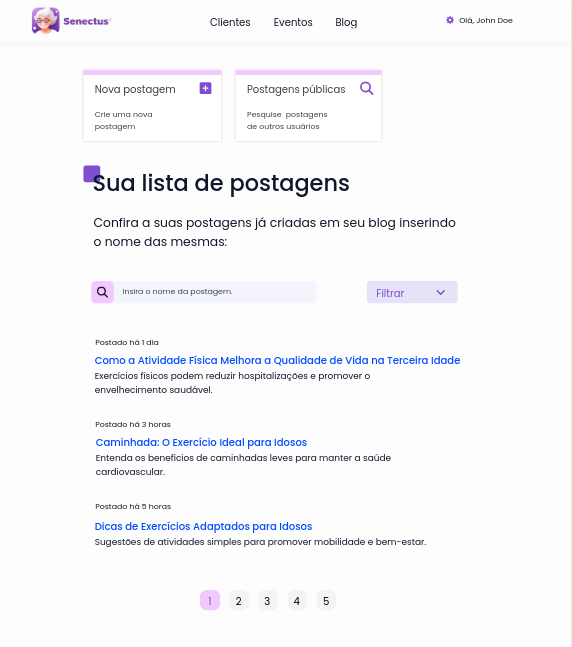
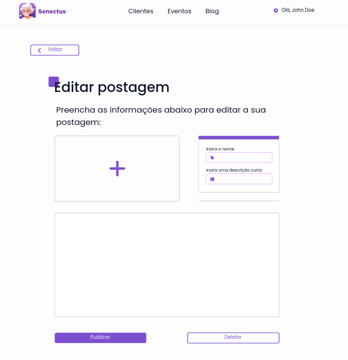

# Módulo de blog

O módulo de blog possui a responsabilidade de gerenciar o fluxo de leitura e criação de artigos dos profissionais da saúde, segue abaixo as telas do protótipo de alta fidelidade do sistema referente a esse módulo:

## Fluxo de usuário comum

## Fluxo do profissional

 
 
 

Ao observar as telas do componente de blog, assim como em outros componentes, percebe-se que quase tudo foi reutilizado, como os inputs, botões, selects, cabeçalho, paginação e cards de atalho (presentes na home do profissional), graças a essa reutilização de componentes o sistema consegue apresentar uma alta consistência na transição de componente a componente e uma das consequências disso é a redução da Carga de Memória de Trabalho, tendo em vista a normalização à adaptação a layouts que já foram vistos anteriormente, como, por exemplo, o componente de eventos que possui um design idêntico ao do blog.

Além da aplicação das regras de ouro já citadas, este componente também valoriza a separação das páginas por regiões, como nas telas de pesquisa, e a utilização de atalhos no dashboard do usuário profissional, onde o mesmo além de já ter o cabeçalho padronizado, contém também os cards que o redirecionam para as outras páginas do sistema, trazendo uma navegação mais suave.
