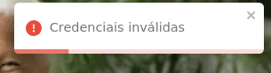
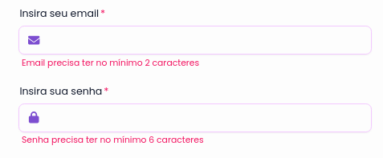

# Comportamento padrão

Como o sistema foi construido utilizando tecnologias que permitem a reutilização de componentes e ferramentas, como o React.js, isso acaba por gerar comportamentos padrões que são propagados em todo o sistema, segue abaixo a lista de comportamentos padrões que foram identificadas:

## Disparos de notificação

Todos os erros que o sistema pode detectar, como os descritos nos casos de uso, deve-se disparar uma notificação customizada utilizando a base de componentes provenientes da biblioteca [toastify](https://fkhadra.github.io/react-toastify/introduction), trazendo assim, um sistema de alertas de erros mais suave e elegante. Adiante, cabe destacar que este tipo de notificação se faz presente sempre que algum erro lógico na aplicação é encontrado, como por exemplo, em tentativas falhas de fazer login, cadastrar contas repetidas, tentativas de preenchimento de informações vazias dos planos de treino e erros não capturados corretamente no fluxo de desenvolvimento. Segue abaixo um exemplo presente na tela de login referente ao erro na falha de autenticação que ocorre ao inserir senhas erradas:

## Padronização de erros de formulário

Para seguir conceitos de form fill mencionados nas recomendações ergonômicas, **todos** os inputs presentes no sistema utilizam-se de um padrão de disparo de erros de validação de formulário, onde cada mensagem de erro é mostrada abaixo dos inputs e a coloração do input é alterada, segue abaixo um exemplo presente no formulário de login, onde os campos do formulários não estçao corretamente preenchidos:

> Cabe destacar que os erros presentes nestes inputs são inúmeros e podem variar com base nas informações inseridas. Logo, um erro de senha pequena o bastante, pode se tornar em um erro de senha grande o bastante para ser armazenada, o mesmo vale para qualquer outro input presente no sistema.
