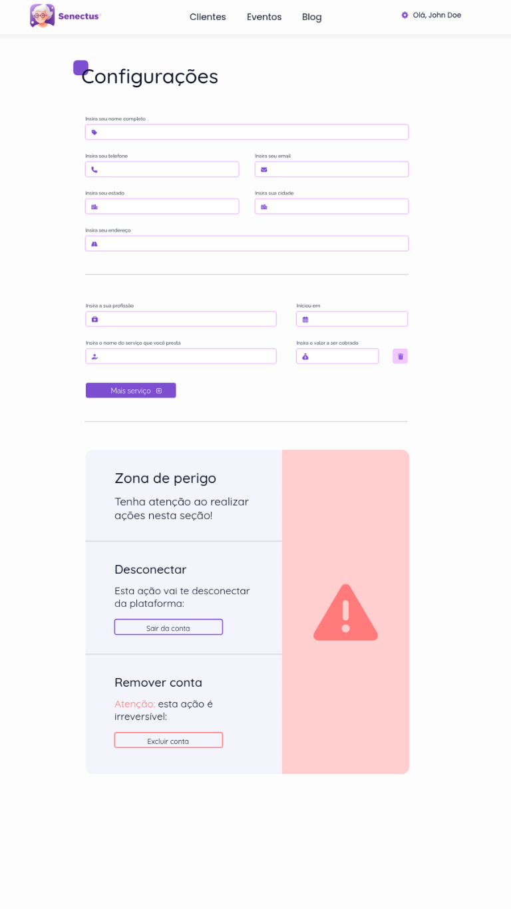

# Módulo de configuração

O módulo de configuração é referente ao controle de opções e informações que o usuário pode manipular na sua conta, segue abaixo todas as telas deste componente:

## Tela do usuário cliente/idoso

## Tela do profissional da saúde

 
 
 

Ambas as telas têm muito em comum quando analisadas lado a lado. Obedecendo assim, boas práticas do design, como a lei de proximidade, região comum, simetria dos princípios Gestalt e a redução da carga de memória de trabalho citada nas regras de outro, isso ocorre devido à simplicidade dos conteúdos e a fácil associação com os ícones em si. Ainda falando sobre as regras de ouro, o componente de configuração de conta do usuário contém uma alta consistência quando comparado com os demais módulos devido à reutilização de todos os componentes já criados no sistema, como, por exemplo, botões e inputs padronizados.
