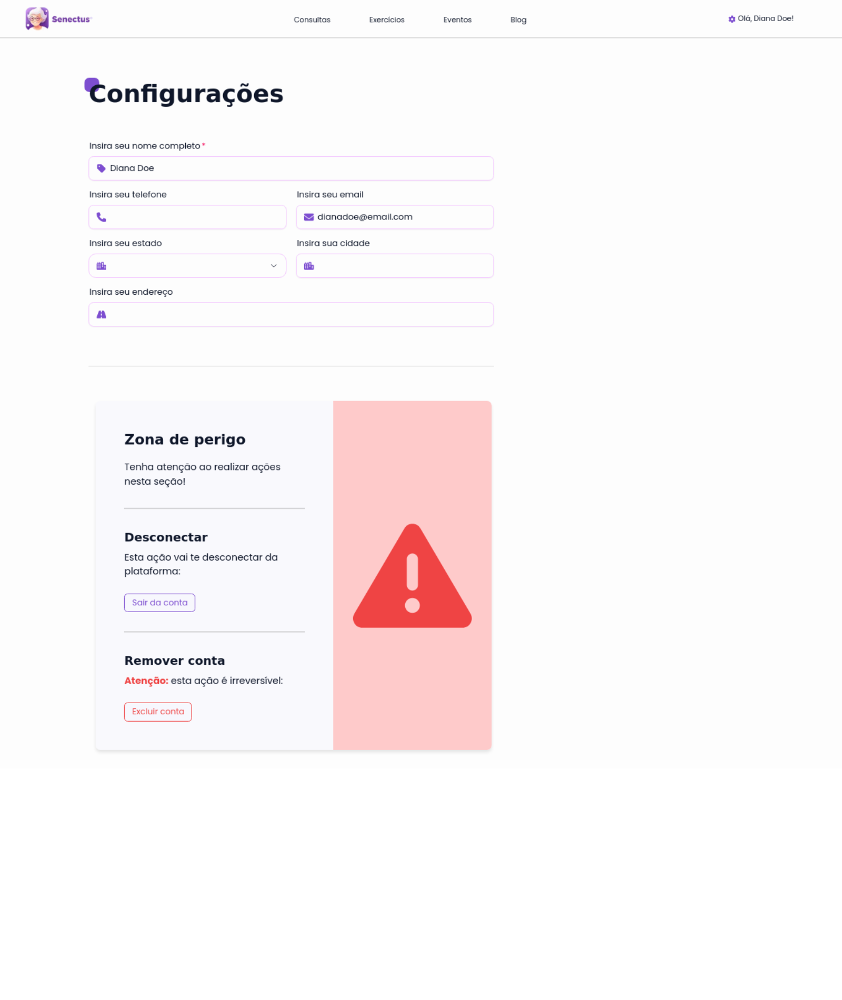
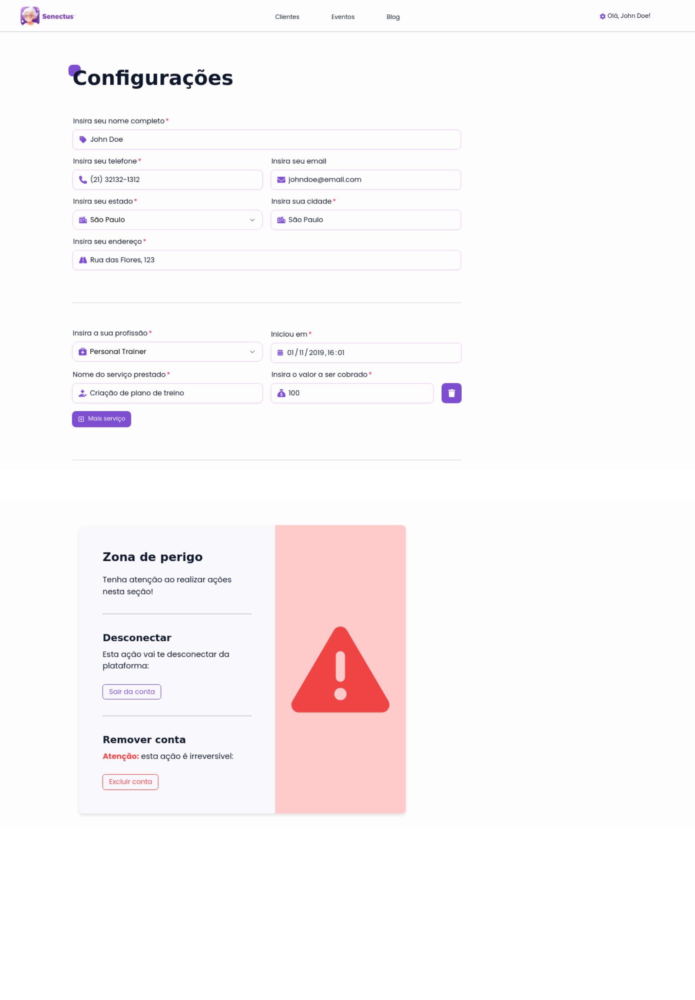
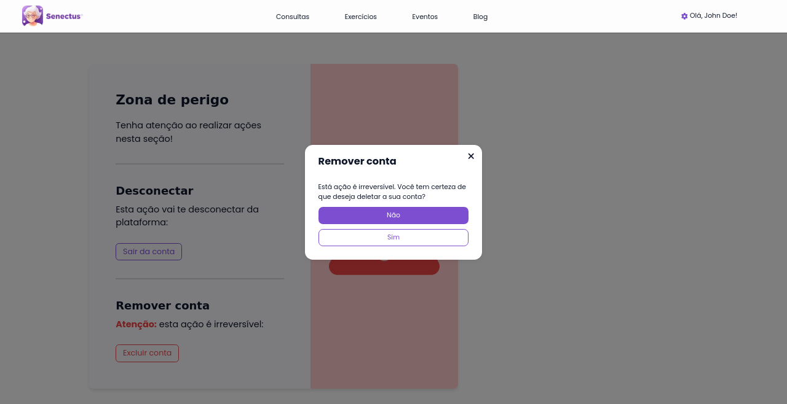
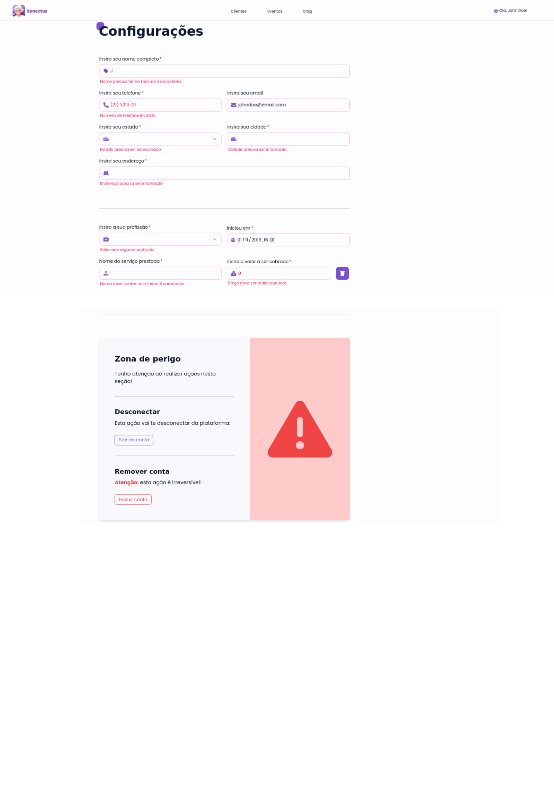

# Módulo de configuração

O módulo de configuração é referente ao controle de opções e informações que o usuário pode manipular na sua conta, segue abaixo todas as telas deste componente:

## Tela do usuário cliente/idoso

## Tela do profissional da saúde

## Modal de confirmação de remoção de conta

## Variações de erros nos inputs

 
 
 

Ambas as telas de configuração possuem estilos extremamente comuns quando comparadas lado a lado e um dos exemplos de princípios em questão é a aplicação de recomendações ergonômicas, como os inputs dos formulários que possuem indicadores de obrigatoriedade ou não e ainda disparam erros para retornar feedbacks ao usuário. Adiante, observa-se a aplicação de um projeto de ícones que busca deixar a aplicação mais intuitiva utilizando-se de mapeamento direto, como no ícone de cidade ao lado dos inputs de localizações geográficas e convenções, como no input de email, onde se utiliza um ícone de envelope para representar emails.

Ainda sobre os princípios e recomendações que estas telas tendem a seguir, é importante ressaltar as regras de ouro que foram alcançadas, como a consistência que se mantém não só nestas páginas, mas em todo o sistema e a prevenção de erros que consegue ser atingida por meio de um modal, evitando que o usuário delete a sua conta por acidente.

Por fim, este componente também segue alguns princípios Gestalt, como a região comum que se é obtida com a separação dos campos de informações pessoais, profissionais e ações a serem tomadas na conta. Além da região comum, também percebe-se um certo nível de simetria entre as informações dispostas na página em conjunto do princípio de proximidade, que é percebido nos inputs agrupados em conjunto, dando a sensação de que agem em grupo.

