# Módulo de consultas

O módulo de consultas possui a responsabilidade de gerenciar o fluxo de consultas e pós-consultas, como, por exemplo, a gestão dos planos de treinos dos clientes, segue abaixo as telas do protótipo de alta fidelidade do sistema referente a esse módulo:

## Fluxo do usuário comum
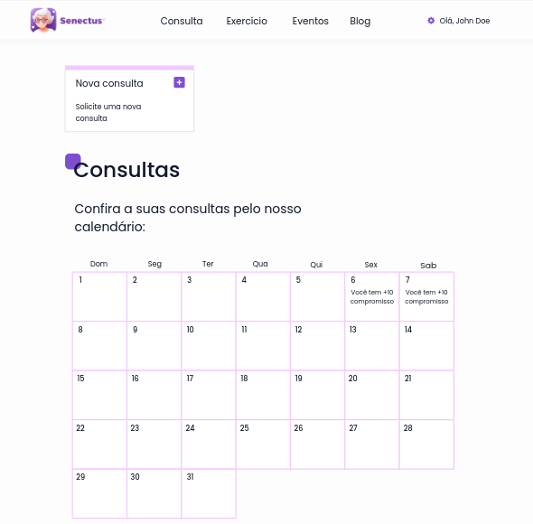
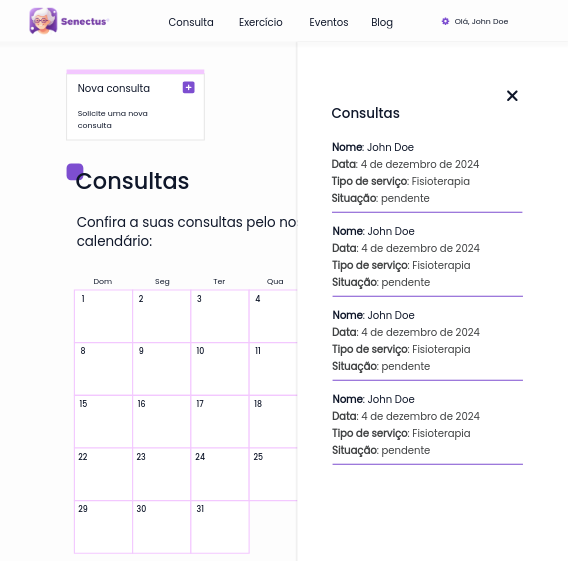
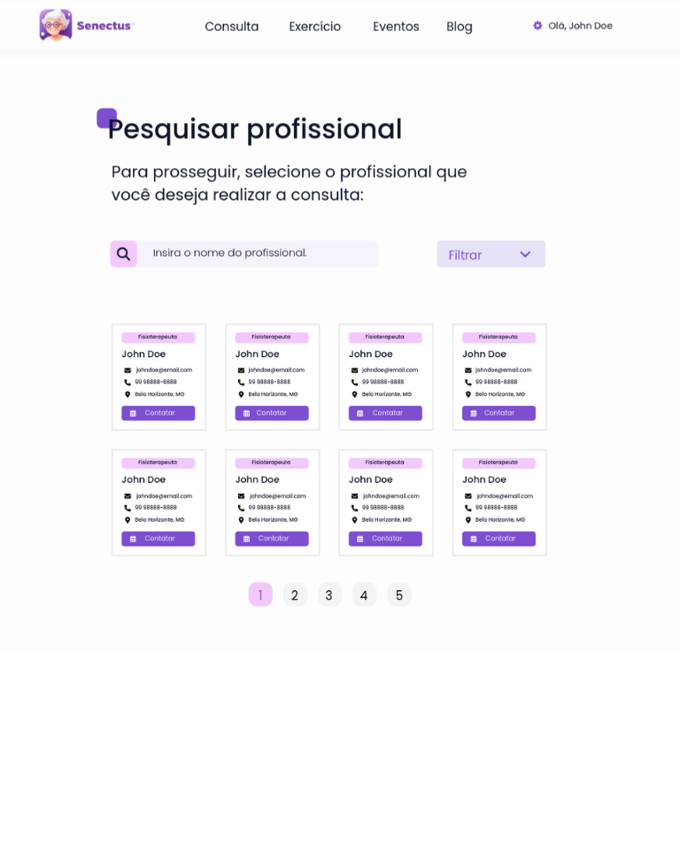
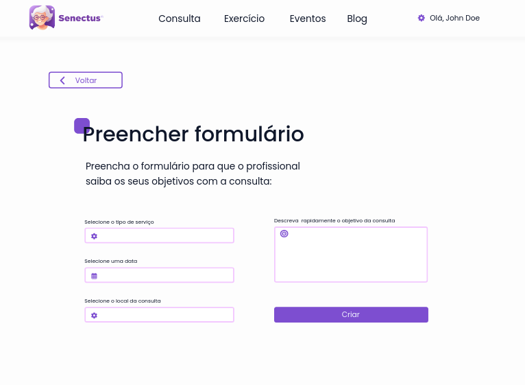

## Fluxo do profissional
### Tela inicial
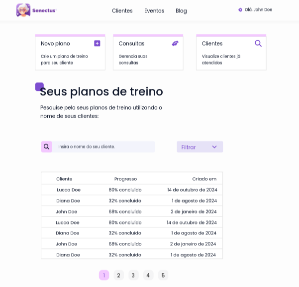

### Tela de visualização de clientes
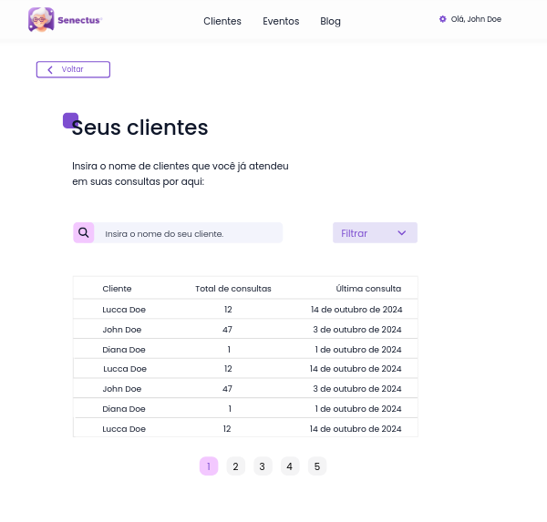

### Tela de visualização de consultas
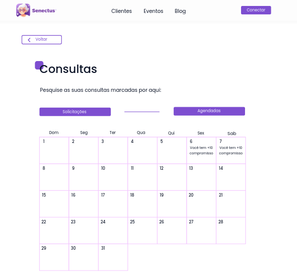
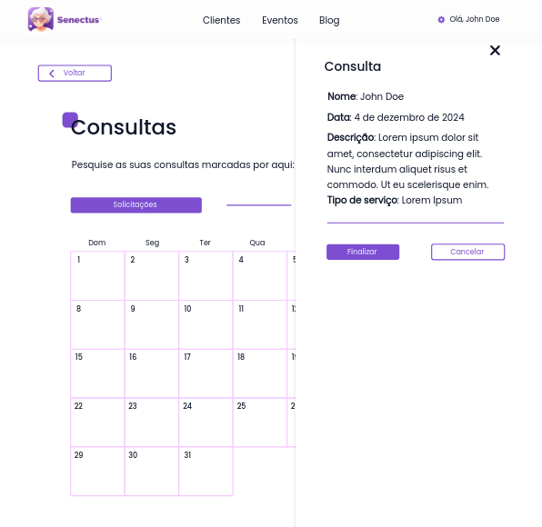
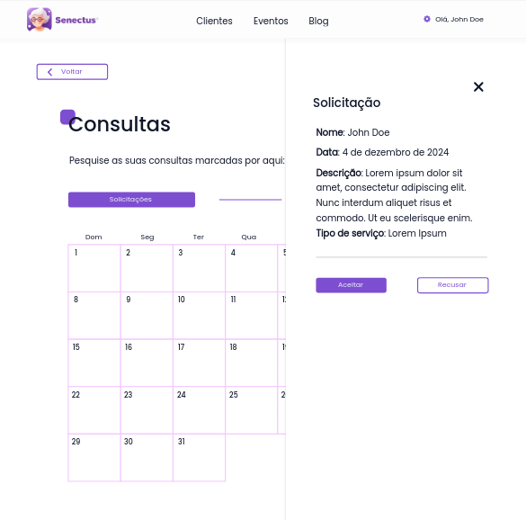

### Sub-fluxo de criação de planos de treino
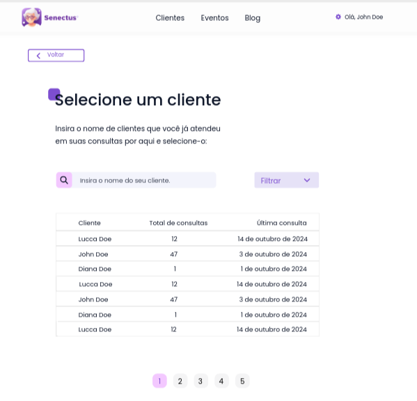
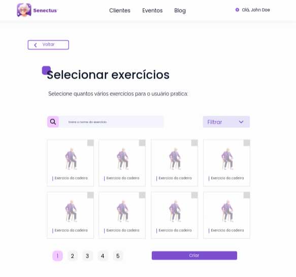
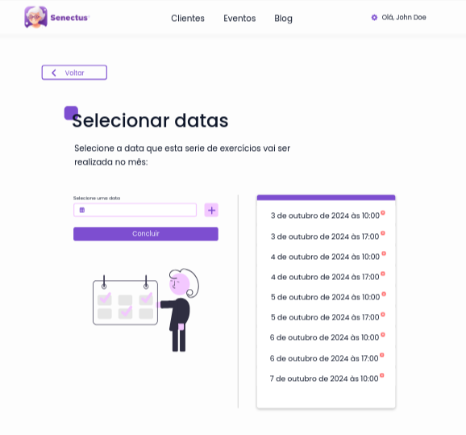
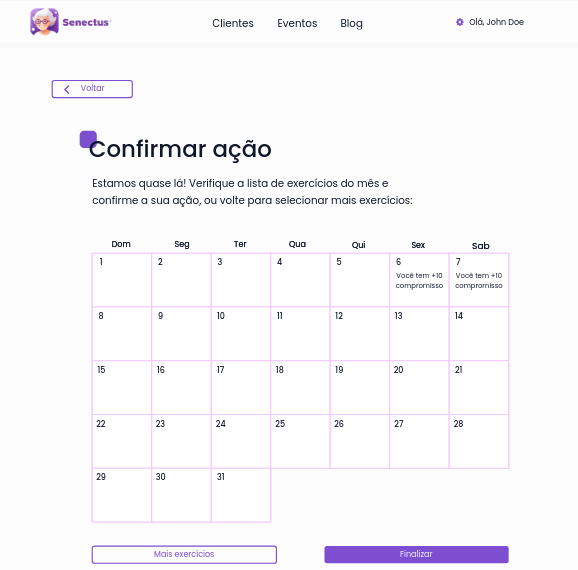
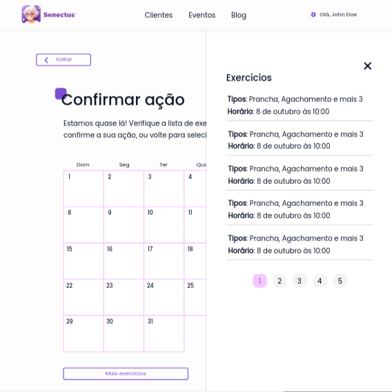

 
 

> Um ponto importante de se notar é que a edição destes planos de treino também utiliza o mesmo fluxo de telas de criação de planos de treino, porém a primeira tela a aparecer é a de confirmar ação e o profissional não pode trocar o cliente.

 
 

Observando os componentes de consultas e pós-consultas, nota-se que assim como os outros componentes, existe uma alta valorização da consistência e reaproveitamento de componentes já existentes para deixar o usuário mais familiarizado com o sistema em si e abordar as regras de ouro do design. Ainda falando das regras de ouro, o sistema também tenta evitar ao máximo erros que podem ser cometidos pelos usuários profissionais, dando a possibilidade do mesmo de reverter as suas ações no processo de criação e edição dos planos de treino.

Por fim, é perceptível a abordagem de princípios Gestalt de simetria e um exemplo disso é a organização dos profissionais presentes na criação de solicitação de consultas.
