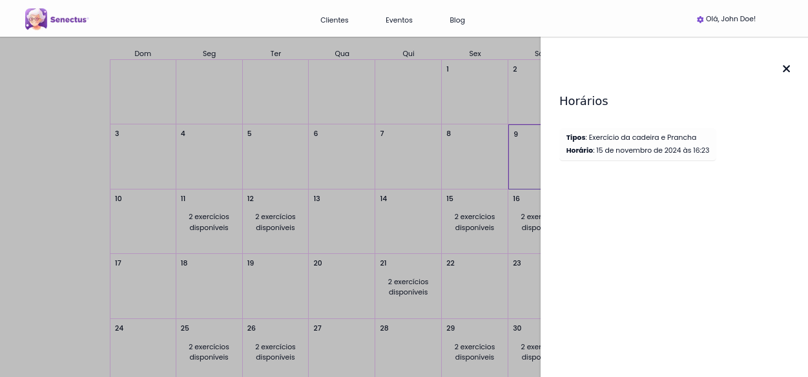

# Módulo de consultas

O módulo de consultas possui a responsabilidade de gerenciar o fluxo de consultas e pós-consultas, como, por exemplo, a gestão dos planos de treinos dos clientes, segue abaixo as telas do protótipo de alta fidelidade do sistema referente a esse módulo:

## Fluxo do usuário comum

## Fluxo do profissional
### Tela inicial

### Tela de visualização de clientes

### Tela de visualização de consultas

>  O modal de cancelamento se faz presente em ambos os menus laterais de visualização de consultas do profissional.

### Sub-fluxo de criação de planos de treino

> - Ao clicar em "Editar lista" o usuário volta para a selação de exercícios com todos que já foram selecionados nesta lista criada
> - Ao clicar em "Remover lista" o usuário remove todos os exercícios desta lista
> - Ao clicar em "Visualizar exercícios" o usuário vai abrir um menu lateral indicando todos os exercícios selecionados neste horário indicado.

 
 

> Um ponto importante de se notar é que a edição destes planos de treino também utiliza o mesmo fluxo de telas de criação de planos de treino, porém a primeira tela a aparecer é a de confirmar ação e o profissional não pode trocar o cliente.

 
 

Ao observar o componente de consulta e pós-consultas, nota-se que o mesmo segue determinadas regras de ouro, assim como os outros componentes, existe uma alta valorização da consistência e reaproveitamento de componentes já existentes para deixar o usuário mais familiarizado com o sistema em si. Além disso, nota-se também a presença de modals de confirmação de ações que não podem facilmente ser revertidas, como o cancelamento de consultas e a remoção de um plano de treino de um cliente. Por fim, ainda falando das regras de ouro, o componente em questão consegue prover uma serie de feedbacks informativos sobre os erros dos usuários, um exemplo deste comportamento pode ser observado nos pop-ups de erros disparados no fluxo de criação de um plano de treino.

Adiante, percebe-se que houve uma seleção de ícones compatíveis com as recomendações ergonômicas, tentando sempre trazer um mapeamento direto, como no card da página inicial do profissional de "Novas consultas", onde o mesmo é representado por um ícone "+" dentro de um quadrado, indicando a adição de um novo plano.

Por último, é perceptível a abordagem de princípios Gestálticos de região comum, como, por exemplo, na pesquisa de um profissional, onde o texto é visivelmente separado tanto da barra de pesquisa e filtro e a própria organização dos cards dos profissionais, que também buscam seguir o princípio de simetria, buscando sempre ocupar lados iguais, tanto no conteúdo interno dos cards quanto quando são agrupados em 8 unidades por página de maneira uniforme e simétrica.
