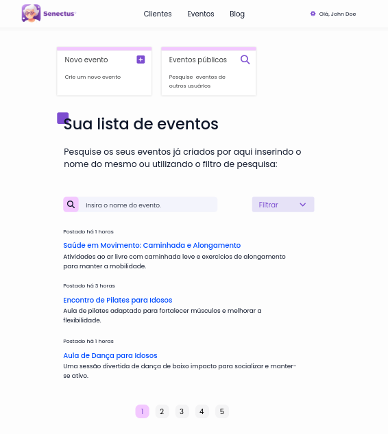
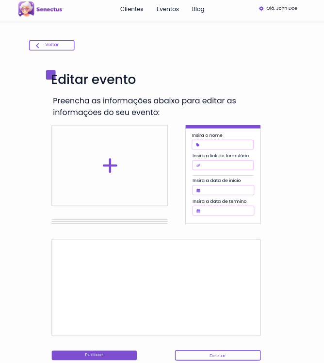

# Módulo de eventos

O módulo de eventos possui a responsabilidade de gerenciar o fluxo de eventos publicados pelos profissionais, dando a possibilidade dos usuários realizarem a sua inscrição de maneira externa ao sistema, segue abaixo as telas do protótipo de alta fidelidade deste módulo:

## Fluxo do usuário comum

## Fluxo do profissional

 
 

Ao analisar os componentes do módulo de eventos, nota-se que são extremamente idênticos ao componente de blog e abordam os mesmos conceitos e princípios Gestalt e das regras de ouro do design, como, por exemplo, a organização por regiões, alta consistência nas telas abordada pela reutilização de sub-componentes, como os botões e inputs e por fim o componente por si só traz uma redução a Carga de Memória de Trabalho devido o alto reaproveitamento de layouts e sub-componentes.
