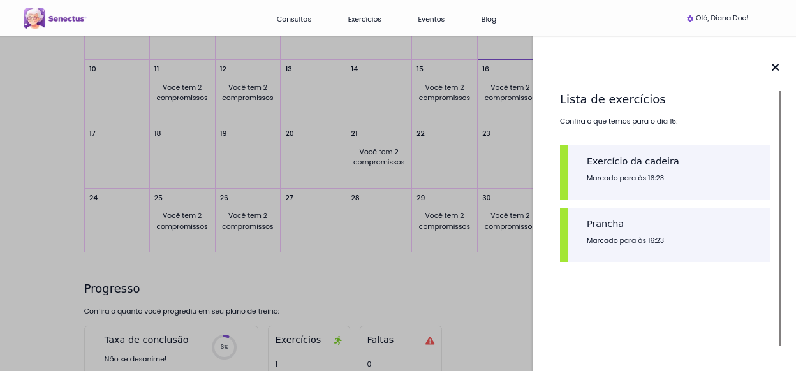
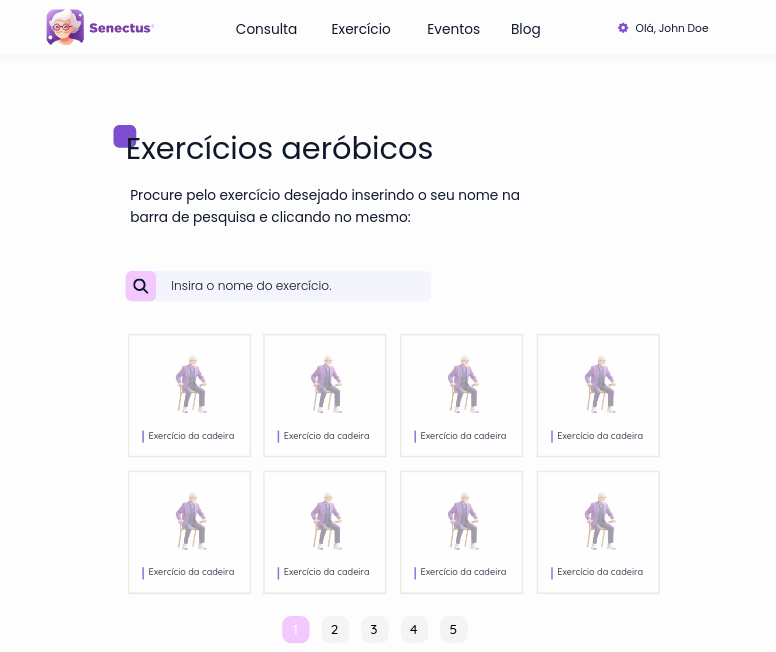

# Módulo de exercícios

O módulo de exercícios possui a responsabilidade de gerenciar todo o fluxo de exercícios do profissional, permitindo-o fazer uso dos planos de treino e da biblioteca de exercícios, segue abaixo as telas do protótipo de alta fidelidade deste módulo:

## Tela inicial dos exercícios

## Fluxo de pesquisa de exercícios da biblioteca

> Esta página também é acessível quando o usuário clica em próximo exercício ou em algum dos exercícios presentes no seu plano de treino

 
 

Ao final, quando se observa estas telas do componente de exercícios nota-se uma alta consistência e reaproveitamento de componentes presentes em outros módulos, como a estilização aplicada nos títulos iniciais de cada página, a tipografia, os botões e inputs de pesquisa. 

Adiante, nota-se também que este componente se organiza por regiões em comum, como, por exemplo, nas instruções dos exercícios, onde a região do vídeo e suas respectivas informações, como média para execução da atividade e dificuldade, estão separadas em regiões diferentes a descrição por texto do exercício.

Por fim, as páginas também obedecem uma simetria quando organizados em conjunto, como, por exemplo, as categorias disponíveis na tela inicial e os cards presentes na pesquisa de exercício.
