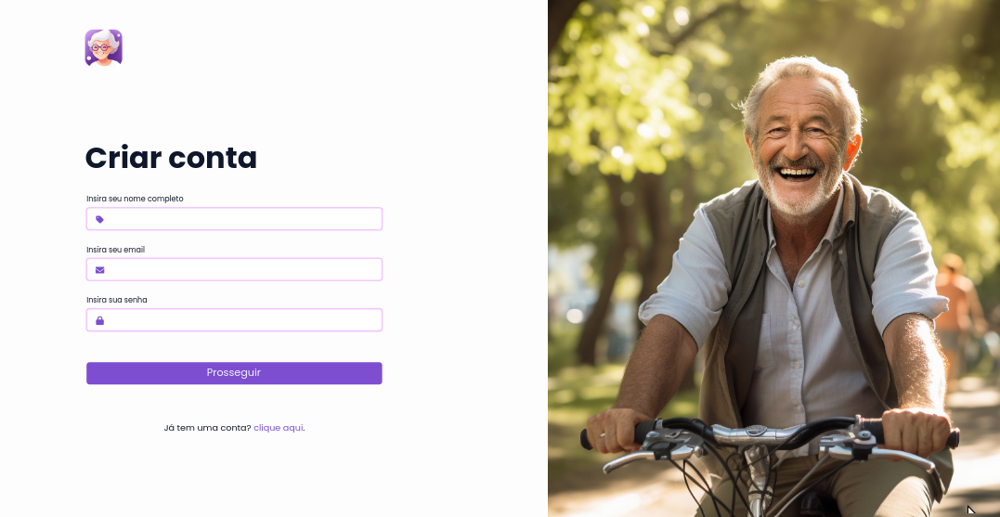
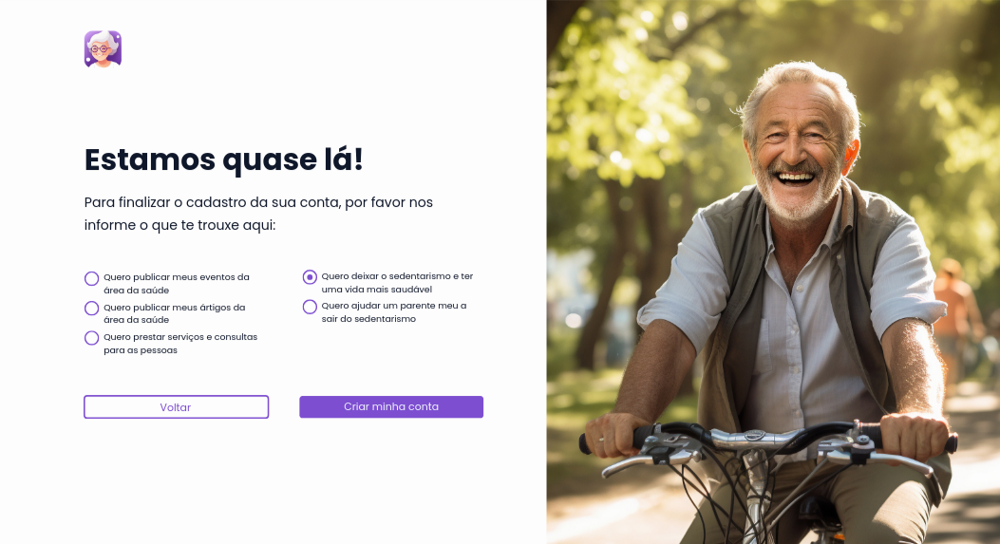

# Módulo de cadastro e login

O módulo de cadastro e login possui a responsabilidade de gerenciar o fluxo de autenticação do usuário, permitindo o mesmo a se cadastrar e conectar em sua conta, segue abaixo as telas do protótipo de alta fidelidade do sistema referente a esse módulo:

## Fluxo de login

## Fluxo de telas de cadastro

 
 
 
 

Ao observar todas as telas de formulário referentes ao módulo de cadastro e login nota-se que todas obedecem certos tipos de regras e princípios que aprimoram a qualidade das mesmas, um desses princípios se faz presente nas recomendações ergonômicas, este sendo o form fill, tal conceito é aplicado na organização dos formulários, utilizando-se de "*" para indicar quais itens são obrigatórios. Ainda falando das recomendações ergonômicas, observa-se também que houve uma seleção de ícones sempre com a intenção de se realizar metáforas, como os cadeados para simbolizar as senhas, ou o uso de convenções, como a utilização de ícones de envelope, que se tornaram convenções para se representar ações que envolvem emails.

Adiante, princípios gestálticos também foram cuidadosamente abordados nestas telas, como a organizações por regiões em comum, como a separação entre texto, inputs e ações extras nos formulários iniciais do fluxo. Além disso, foi abordado princípios de proximidade em cada tela para agrupar determinados componentes e dar a impressão de que ambos agem em grupos, como os inputs e botões e os radios buttons na última página de cadastro.

Por fim, observa-se que assim como as outras páginas a consistência foi um dos fatores-chave para trazer uma sensação de familiaridade para o usuário, todos os botões, inputs, tipografia foram reutilizados sempre que possível e isso pode ser observado ao navegar pelas outras telas.
