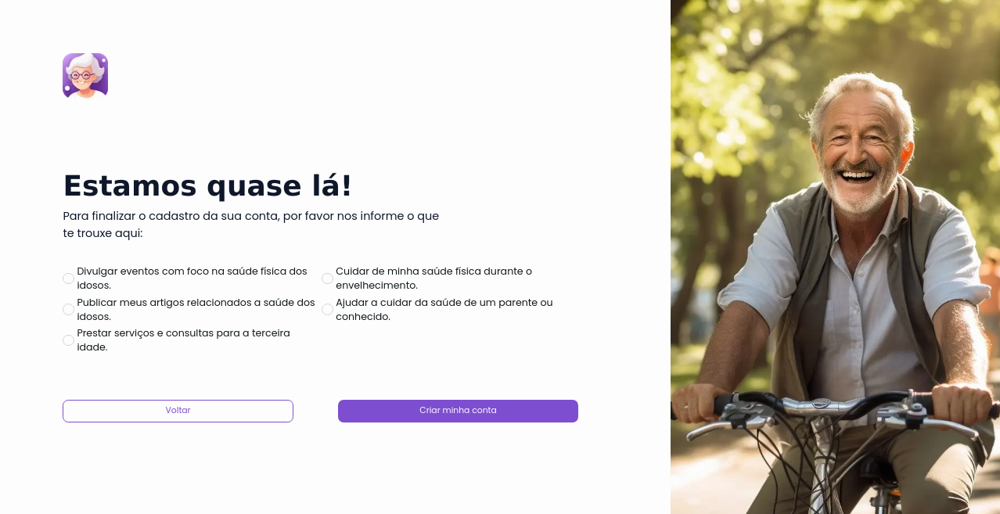

# Módulo de cadastro e login

O módulo de cadastro e login possui a responsabilidade de gerenciar o fluxo de autenticação do usuário, permitindo o mesmo a se cadastrar e conectar em sua conta, segue abaixo as telas do protótipo de alta fidelidade do sistema referente a esse módulo:

## Fluxo de login

## Fluxo de telas de cadastro

 
 
 
 

Ao observar tanto o fluxo de login quanto de cadastro notam-se várias semelhanças entre os mesmos, contendo uma alta consistência e reaproveitamento de componentes do sistema, como, por exemplo, os inputs, botões e tipografia. Cabe destacar que os componentes em si contém simetria e regiões em comum que são interpretadas pelos usuários logo de cara devido à padronização, como, por exemplo, a separação entre título inicial com sua descrição, se necessário, e o formulário de resposta. Como consequência desta arquitetura de telas, torna-se visível que este componente tenta seguir ao máximo as regras de ouro do design em conjunto dos princípios de Gestalt.
